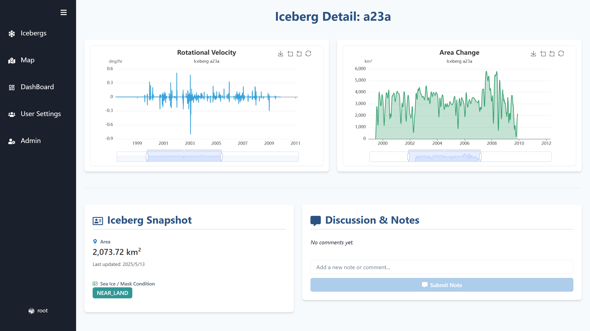
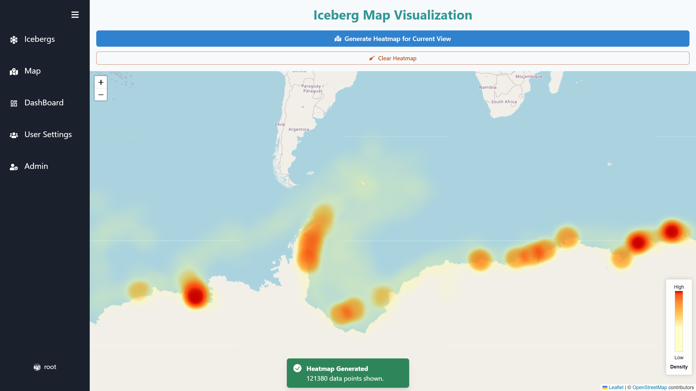
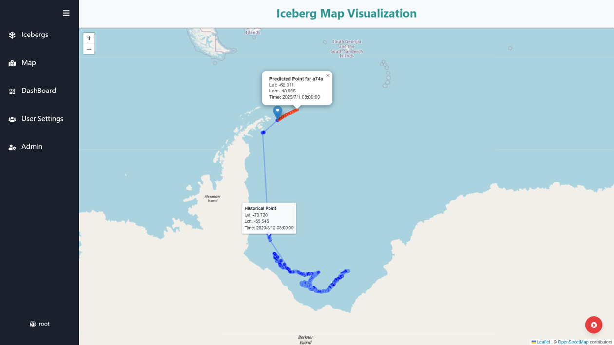
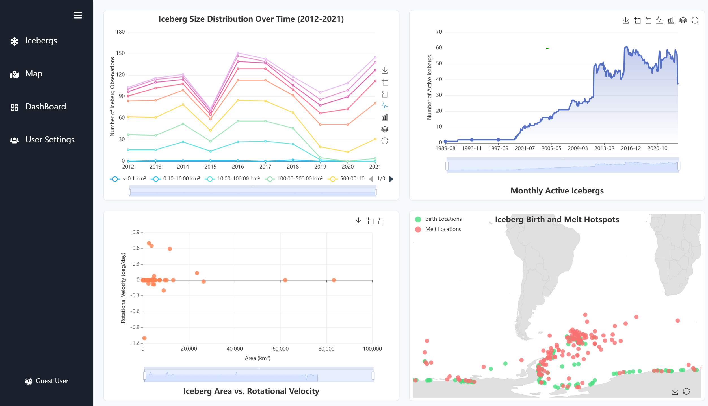
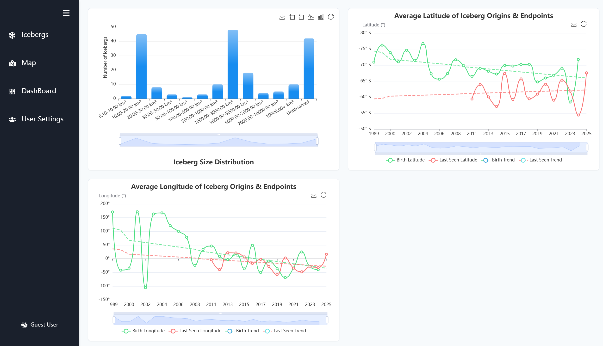

<p align="center">
    
</p>

## Iceberg Visualization Project
Iceberg visualization project built with `React` as frontend and `Flask` as backend.
<p align="center">
    
</p>

Pages      | Visualization                                                                  
------------ | ------------ 
**Individual Iceberg Visualization** | 
**Iceberg Regional Density** | 
**Iceberg Trajectory** | 
**Visualization Dashboard 1** | 
**Visualization Dashboard 2** | 

### Project Description
This is an iceberg visualization project built with data from [BYU iceberg database]((https://www.scp.byu.edu/current_icebergs.html)), aiming to facilitate research and usage of iceberg data. The main features of this project are: 
1. A **robust backend**, cleaning and organizing data from original BYU database, initializing the backend database with both static file data and dynamic web data.
2. **Visualizations in the frontend**. Multiple interactive graphs are created to display iceberg locations, number changes and movement patterns. 

The project is built in a modular way, when extending this project for your own need, you only have to: 
1. Add new pages under `client/src/pages/` directory, and add the corresponding component to `Routes.tsx`.
2. Create corresponding api in the backend under `server/routes` folder, and send request to this api through `axios` in the frontend.

### Setting up Project
- Frontend: `React+Vite+Typescript`, to setup relating packages, use:
```bash
cd client
npm i
```
- Backend: `Flask`
```bash
cd ../server
pip install flask flask_cors flask_sqlalchemy
pip install flask_jwt_extended # json web token
cd ..
pip install -e .
```
- Then to run the project and then enjoy it at `localhost:5173`:
```bash
cd server
python app.py
cd ../client
npm run dev
```
- Database is initialized with a `root` user, who is a manager of the database. Key for this user can be set at `server/config.py`, and is `111` currently. 
- The first time this project is run, a database file `db.sqlite` will be generated under `src/server/instance`, which contains all static files under `data` folder (initialization process would take around 5min). Later on when developing this project, **we strongly recommend that you do not reinitialize this database**, to prevent reinitialization, **comment the usage of `_initialize_database`** (line 44) in `server/app.py`.